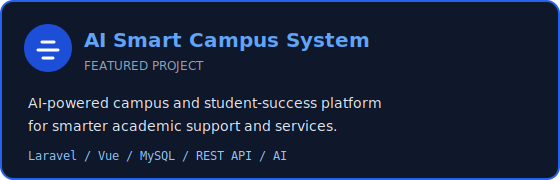
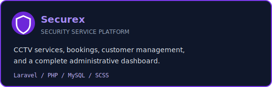
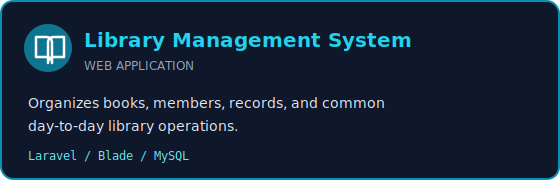
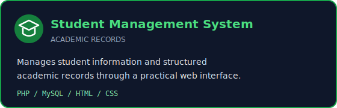
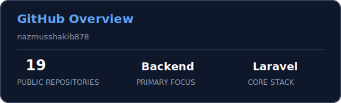

<div align="center">
  

  
</div>

<p align="center">
  <a href="mailto:nazmusshakib335@gmail.com"></a>
  <a href="https://github.com/nazmusshakib878?tab=repositories"></a>
  
</p>

## Developer Profile

```yaml
name: Md. Nazmus Shakib
location: Khulna, Bangladesh
education: Final-year B.Sc. in Computer Science and Engineering
primary_focus: Backend Engineering
current_stack: [PHP, Laravel, MySQL, REST APIs]
exploring: [Python, Machine Learning, LLM Applications, RAG, AI Agents]
open_to: [Backend Roles, Internships, Open-source Collaboration]
```

I turn real-world requirements into maintainable backend systems and practical web applications. My current work combines **Laravel application architecture**, **relational database design**, and **API development**, while I build a strong foundation in AI engineering.

## Engineering Focus

<table>
  <tr>
    <td width="33%" valign="top">
      <h3>Backend Systems</h3>
      Laravel architecture, REST API design, authentication, authorization, RBAC, validation, and database-backed workflows.
    </td>
    <td width="33%" valign="top">
      <h3>Quality & Delivery</h3>
      Clean code, Git workflows, unit and feature testing, API documentation, CI/CD fundamentals, and deployment practices.
    </td>
    <td width="33%" valign="top">
      <h3>AI Engineering</h3>
      Python and ML foundations, prompt engineering, LLM applications, retrieval-augmented generation, tool use, and agents.
    </td>
  </tr>
</table>

## Technology Stack

<div align="center">

**Backend & Data**


**Languages & Web**


**Developer Tools**


</div>

## Selected Work

<div align="center">
  <a href="https://github.com/nazmusshakib878/CSE4204-8A-T07-ai-smart-campus-system">
    
  </a>
  <a href="https://github.com/nazmusshakib878/Securex">
    
  </a>
  <a href="https://github.com/nazmusshakib878/Library-management-project">
    
  </a>
  <a href="https://github.com/nazmusshakib878/student-management-system">
    
  </a>
</div>

<details>
  <summary><strong>Project highlights</strong></summary>
  <br />

  - **AI Smart Campus System:** AI-powered campus and student-success platform built around Laravel, MySQL, REST APIs, and a modern frontend.
  - **Securex:** CCTV and security-service management platform with public services, booking workflows, customer management, and an admin dashboard.
  - **Library Management System:** Web application for organizing books, members, records, and common library operations.
  - **Student Management System:** PHP and MySQL application for managing student information and academic records.
</details>

## GitHub Insights

<div align="center">
  
  
</div>

<div align="center">
  
</div>

<picture>
  <source media="(prefers-color-scheme: dark)" srcset="https://raw.githubusercontent.com/nazmusshakib878/nazmusshakib878/output/github-contribution-grid-snake-dark.svg" />
  <source media="(prefers-color-scheme: light)" srcset="https://raw.githubusercontent.com/nazmusshakib878/nazmusshakib878/output/github-contribution-grid-snake.svg" />
  
</picture>

## Currently Leveling Up

- Production-ready Laravel architecture and reusable service patterns
- Automated unit and feature testing for backend applications
- Secure API design, versioning, RBAC, and documentation
- Python-based ML workflows and practical LLM applications
- RAG pipelines, tool-enabled assistants, and AI-agent fundamentals

---

<div align="center">
  <h3>Open to building useful products and learning with strong engineering teams.</h3>
  <p>
    <a href="mailto:nazmusshakib335@gmail.com">Start a conversation</a>
    &nbsp; - &nbsp;
    <a href="https://github.com/nazmusshakib878?tab=repositories">Explore my repositories</a>
  </p>
  
</div>
