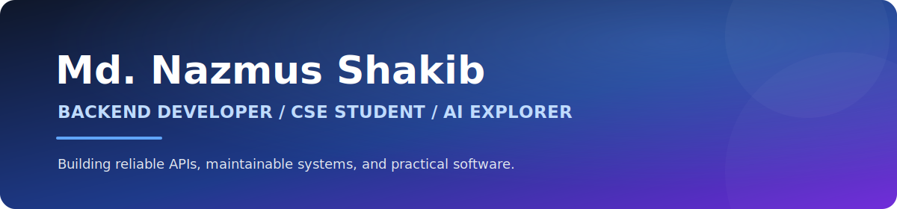

<p align="center">
  
</p>

<p align="center">
  <a href="mailto:nazmusshakib335@gmail.com"><strong>Email</strong></a>
  &nbsp;&nbsp;|&nbsp;&nbsp;
  <a href="https://github.com/nazmusshakib878?tab=repositories"><strong>Projects</strong></a>
  &nbsp;&nbsp;|&nbsp;&nbsp;
  <a href="https://github.com/nazmusshakib878"><strong>GitHub</strong></a>
</p>

<p align="center"><strong>Available for backend opportunities, internships, and meaningful collaboration.</strong></p>

## Professional Summary

Final-year Computer Science and Engineering student from Khulna, Bangladesh, focused on backend development. I build maintainable web applications and REST APIs with PHP, Laravel, and MySQL while developing practical skills in AI engineering.

My interests include clean application architecture, secure authentication and authorization, relational database design, automated testing, API documentation, and production-ready delivery.

## Core Competencies

| Area | Technologies and practices |
|---|---|
| Backend Engineering | PHP, Laravel, REST APIs, authentication, authorization, RBAC, validation |
| Data and Persistence | MySQL, relational modeling, migrations, query design |
| Programming | Python, Java, C, C++, JavaScript |
| Web Fundamentals | HTML5, CSS3, responsive interfaces |
| Engineering Workflow | Git, GitHub, VS Code, testing, CI/CD fundamentals, documentation |
| AI Engineering | ML foundations, prompt engineering, LLM applications, RAG, tool use, AI agents |

## Selected Projects

### [AI Smart Campus System](https://github.com/nazmusshakib878/CSE4204-8A-T07-ai-smart-campus-system)

AI-powered campus and student-success platform designed to support academic workflows and smarter student services.

`Laravel` `Vue` `MySQL` `REST API` `AI`

### [Securex](https://github.com/nazmusshakib878/Securex)

CCTV and security-service management platform with service listings, bookings, customer management, and an administrative dashboard.

`Laravel` `PHP` `MySQL` `SCSS`

### [Library Management System](https://github.com/nazmusshakib878/Library-management-project)

Web application for organizing books, members, records, and common library operations.

`Laravel` `Blade` `MySQL`

### [Student Management System](https://github.com/nazmusshakib878/student-management-system)

PHP and MySQL application for managing student information and academic records.

`PHP` `MySQL` `HTML` `CSS`

<p align="center">
  <a href="https://github.com/nazmusshakib878?tab=repositories"><strong>View all repositories</strong></a>
</p>

## Current Development Focus

- Production-ready Laravel architecture and reusable service patterns
- Secure API versioning, authentication, RBAC, validation, and documentation
- Unit and feature testing for backend applications
- GitHub workflows, CI/CD, and deployment fundamentals
- Python-based ML workflows and practical LLM applications
- Retrieval-augmented generation and tool-enabled AI assistants

## How I Work

```text
Understand the requirement
        -> design the data and API contract
        -> implement clear, maintainable code
        -> validate behavior and edge cases
        -> document decisions and delivery steps
```

## Contact

I am interested in backend engineering roles, internships, and collaborative projects where I can contribute, learn, and build useful software.

- Email: [nazmusshakib335@gmail.com](mailto:nazmusshakib335@gmail.com)
- GitHub: [github.com/nazmusshakib878](https://github.com/nazmusshakib878)
- Location: Khulna, Bangladesh

---

<p align="center"><strong>Reliable software starts with clear thinking, careful implementation, and continuous learning.</strong></p>
